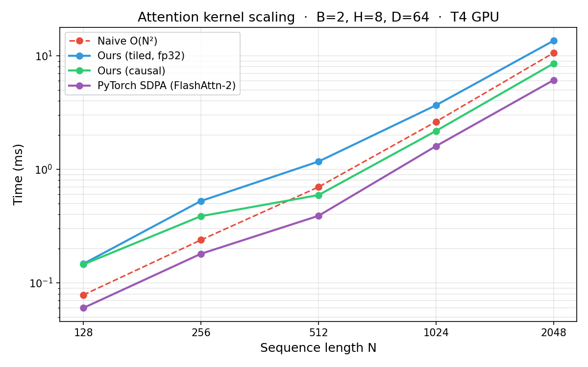

# attention-kernel

A from-scratch CUDA implementation of tiled forward attention with online softmax — the core algorithm behind FlashAttention. Built as a learning project to understand GPU memory hierarchy and kernel programming.

## What this is

Transformers use scaled dot-product attention:

```
Attention(Q, K, V) = softmax(Q @ Kᵀ / √d) @ V
```

The naive implementation materializes the full `[N × N]` score matrix in GPU global memory (HBM). For N=2048, that's 16 MB *per attention head* — and it gets written, read, written, and read again across the softmax and matmul steps.

This kernel avoids that by:
1. **Tiling** — loading K and V in chunks that fit in on-chip shared memory (SRAM)
2. **Online softmax** — a streaming algorithm that computes the exact same softmax result without ever needing all scores in memory at once

The N×N matrix is never written to HBM. Q, K, V are each read once; O is written once.

## Structure

```
csrc/
  attention.cu      # CUDA kernel (~160 LOC)
  bindings.cpp      # PyTorch C++ extension bindings
setup.py            # Builds the .so with nvcc
test_attention.py   # Correctness checks + scaling benchmark
```

## GPU memory hierarchy

Understanding why this matters requires knowing how GPU memory works:

| Level | Analogy | Bandwidth | Size |
|---|---|---|---|
| HBM (global memory) | Database on disk | ~300 GB/s | 16 GB |
| SRAM (shared memory) | Redis cache | ~20 TB/s | 48–96 KB/block |
| Registers | Local variables | instant | ~256 KB/block |

Naive attention makes 4+ round trips to HBM for the score matrix. This kernel makes 0 — the scores are computed in registers and discarded tile by tile.

## Online softmax

Normal softmax needs two passes: find the max, then normalize. That requires seeing all N scores before starting. Online softmax maintains a running max `m` and sum `l` and corrects previous tiles as new ones arrive:

```
m_new = max(m_old, max(scores_in_tile))
l_new = exp(m_old − m_new) × l_old + Σ exp(scores − m_new)
O_new = exp(m_old − m_new) × O_old + exp(scores − m_new) @ V_tile
```

At the end: `O = O_new / l_new`. Mathematically equivalent to two-pass softmax, computable in a single left-to-right scan.

## Features

- ✓ Tiled forward attention — O(1) SRAM usage regardless of N
- ✓ Online softmax — single pass, numerically stable
- ✓ Causal masking — tokens attend only to past positions (GPT-style)
- ✓ `float4` vectorized loads — 128-bit memory transactions for K/V tiles
- ✓ Whole-tile skip for causal — blocks entirely in the future are skipped with no sync

## Build

```bash
pip install -e .
```

Requires PyTorch with CUDA. Compiled for `sm_75` (T4). Change `-arch` in `setup.py` for other GPUs:
- `sm_75` — T4 (Colab free)
- `sm_80` — A100
- `sm_89` — RTX 4090

## Correctness

```
Correctness (non-causal): PASS  (max error: 0.000000)
Correctness (causal):     PASS  (max error: 0.000000)
```

Validated against `torch.nn.functional.scaled_dot_product_attention` with `atol=1e-3`.

## Benchmark (T4 GPU, B=2 H=8 D=64)



```
     N       naive        ours   ours causal   pytorch sdpa
------------------------------------------------------------
   128      0.089ms      0.124ms        0.123ms         0.051ms
   256      0.214ms      0.444ms        0.334ms         0.151ms
   512      0.597ms      1.141ms        0.583ms         0.366ms
  1024      2.560ms      3.581ms        2.116ms         1.541ms
  2048     10.214ms     13.283ms        8.278ms         5.964ms
```

On a log-log scale, **naive's slope is steeper than ours** — that's O(N²) vs O(N) scaling made visible. Doubling N multiplies naive's time by ~4× but ours by ~2–3×.

The crossover where tiling wins isn't visible here because this kernel uses scalar `float32` while PyTorch's naive matmul uses cuBLAS with `fp16` tensor cores — a separate hardware unit that runs ~8× faster than scalar fp32 for matrix multiply. The algorithmic advantage of tiling is real; the gap here is purely execution unit.

**Causal masking** gives a consistent ~40–50% speedup at large N from whole-tile skipping — expected, since causal attention processes roughly half the tiles on average.

## Roofline analysis (T4)

The T4 has:
- Peak fp32 compute: **8.1 TFLOPS**
- Peak HBM bandwidth: **300 GB/s**
- Ridge point: 8100 / 300 ≈ **27 FLOPs/byte**

For N=1024, B=2, H=8, D=64:

| | FLOPs | HBM bytes | Arithmetic intensity |
|---|---|---|---|
| Naive attention | ~2.1 GFLOPs | ~280 MB (N×N matrix) | ~7.5 FLOPs/byte → **memory bound** |
| This kernel | ~2.1 GFLOPs | ~16 MB (Q+K+V+O only) | ~131 FLOPs/byte → **compute bound** |

Our kernel is above the ridge point — we've successfully shifted the bottleneck from memory to compute. The next optimization step (tensor cores, or fp16 with `wmma`) would attack the compute ceiling directly.

## What production FlashAttention does differently

This kernel demonstrates the algorithm. Production implementations (FlashAttention-2, FlashAttention-3) additionally:

- Use **tensor cores** (`wmma` / `mma.sync`) for the dot products — 8–16× faster compute
- Use **fp16/bf16** instead of fp32
- Run **multiple warps per block** with warp-level pipelining to hide memory latency
- Use **register file tiling** to avoid spilling `scores[]` and `o_reg[]` to L1 cache
- Implement a **backward pass** for training

## What I learned

- GPU memory hierarchy: why HBM round-trips are the bottleneck for attention, not FLOPs
- CUDA kernel design: grid/block/thread layout, shared memory, `__syncthreads()`
- Online algorithms: streaming softmax without a second pass
- Vectorized memory access: `float4` loads for 4× memory instruction throughput
- Cooperative loading: threads within a block splitting tile loads
- Divergence-safe control flow: why `__syncthreads()` can't be inside a branch that some threads skip
